# 🩻 🌠 Awesome Nano Banana for Medical Imaging

[](https://awesome.re)
[](LICENCE)
[](./README.md)

> 一个精心整ç†çš„**æ示ã€ç¤ºä¾‹**集åˆï¼Œæ¢ç´¢**Nano Banana (Gemini-2.5-Flash-Image)** 模å‹åœ¨**医学图åƒç ”究**中的应用。

---

## 👋 欢è¿

Awesome Nano Banana for Medical Imaging 是一个社区驱动的æ¢ç´¢æ€§ä»“库，旨在调查 Gemini-2.5-Flash-Image（"Nano Banana"）模å‹â€”—一ç§é€šç”¨è§†è§‰-语言生æˆæ¨¡å‹â€”—在医学图åƒä»»åŠ¡ä¸­çš„潜在应用。

该项目旨在收集ã€æ¢ç´¢å’Œè¡¨å¾é€šç”¨ AGI 导å‘生æˆæ¨¡å‹åœ¨åŒ»å­¦æˆåƒèƒŒæ™¯ä¸‹çš„能力。该仓库寻求æ­ç¤ºæ­¤ç±»æ¨¡å‹çš„新兴能力，并激å‘åœ¨ç”Ÿæˆ AI 和医学æˆåƒäº¤å‰é¢†åŸŸçš„进一步研究。潜在应用包括数æ®å¢å¼ºã€ä¸´åºŠå’Œæ•™è‚²ç¯å¢ƒä¸­çš„跨模æ€ç†è§£ï¼Œä»¥åŠä½¿ç”¨ç”Ÿæˆæ¨¡å‹è¿›è¡ŒåŒ»å­¦æ•™è‚²ã€æ¨¡æ‹Ÿå’Œè§†è§‰æ²Ÿé€šã€‚

âš ï¸ **é‡è¦é€šçŸ¥**

* 所有示例图åƒéƒ½æ˜¯**公开å¯ç”¨**且**匿å化**的。
* **ä¸åŒ…å«å—ä¿æŠ¤çš„å¥åº·ä¿¡æ¯ (PHI)**。
* 生æˆè¾“出是**åˆæˆ**çš„ã€**é临床**的，仅用äº**研究和教学**。
* 示例**ä¸å¾—用äºè¯Šæ–­ã€æ²»ç–—或任何临床决策**。


## 📋 示例列表
- [示例 1：MRI 切片中异常区域的检测](#示例-1mri-切片中异常区域的检测)
- [示例 2：CT 图åƒä¸­å¼‚常区域的检测](#示例-2ct-图åƒä¸­å¼‚常区域的检测)
- [示例 3：移除 MRI 中的ä¸å¥åº·åŒºåŸŸ (a)](#示例-3移除-mri-中的ä¸å¥åº·åŒºåŸŸ-a)
- [示例 4：移除 MRI 中的ä¸å¥åº·åŒºåŸŸ (b)](#示例-4移除-mri-中的ä¸å¥åº·åŒºåŸŸ-b)
- [示例 5：生æˆå¤§è„‘çš„å¥åº·ç‰ˆæœ¬](#示例-5生æˆå¤§è„‘çš„å¥åº·ç‰ˆæœ¬)
- [示例 6：注释 MRI 而ä¸æ”¹å˜åƒç´ ](#示例-6注释-mri-而ä¸æ”¹å˜åƒç´ )
- [示例 7：注释手术图åƒè€Œä¸æ”¹å˜åƒç´ ](#示例-7注释手术图åƒè€Œä¸æ”¹å˜åƒç´ )
- [示例 8：识别 MRI 中的æˆåƒè§†å›¾å’Œè§£å‰–区域](#示例-8识别-mri-中的æˆåƒè§†å›¾å’Œè§£å‰–区域)
- [示例 9ï¼šä» MRI 扫æ中移除注释](#示例-9ä»-mri-扫æ中移除注释)
- [示例 10：ä»æ‰‹æœ¯æ‰«æ中移除注释](#示例-10ä»æ‰‹æœ¯æ‰«æ中移除注释)
- [示例 11ï¼šä» MRI 图åƒä¸­ç§»é™¤é¢…骨](#示例-11ä»-mri-图åƒä¸­ç§»é™¤é¢…骨)
- [示例 12ï¼šä» MRI 图åƒä¸­ç§»é™¤é¢…骨（替代方案）](#示例-12ä»-mri-图åƒä¸­ç§»é™¤é¢…骨替代方案)
- [示例 13：ä»å¿ƒè„ MRI 生æˆè¶…声](#示例-13ä»å¿ƒè„-mri-生æˆè¶…声)
- [示例 14：ä»çŸ¢çŠ¶ MRI ç”Ÿæˆ 3D 脊柱模å‹](#示例-14ä»çŸ¢çŠ¶-mri-生æˆ-3d-脊柱模å‹)
- [示例 15ï¼šä» 3D 腹部é‡å»ºç”Ÿæˆè…¹éƒ¨ CT](#示例-15ä»-3d-腹部é‡å»ºç”Ÿæˆè…¹éƒ¨-ct)
- [示例 16：生æˆå¤§è„‘çš„ 3D 网格](#示例-16生æˆå¤§è„‘çš„-3d-网格)
- [示例 17：生æˆç‰™é½¿çš„ 3D 网格](#示例-17生æˆç‰™é½¿çš„-3d-网格)
- [示例 18：模拟大脑中肿瘤进展](#示例-18模拟大脑中肿瘤进展)
- [示例 19：ä»å¤§è„‘扫æ中移除病å˜](#示例-19ä»å¤§è„‘扫æ中移除病å˜)
- [示例 20ï¼šä» MRI 扫æ中移除伪影 (1)](#示例-20ä»-mri-扫æ中移除伪影-1)
- [示例 21ï¼šä» MRI 扫æ中移除伪影 (2)](#示例-21ä»-mri-扫æ中移除伪影-2)
- [示例 22：分割图åƒä¸­æ‰€æœ‰å¯è§å™¨å®˜](#示例-22分割图åƒä¸­æ‰€æœ‰å¯è§å™¨å®˜)
- [示例 23：分割图åƒä¸­æ‰€æœ‰å¯è§å™¨å®˜ï¼ˆå åŠ ï¼‰](#示例-23分割图åƒä¸­æ‰€æœ‰å¯è§å™¨å®˜å åŠ )
- [示例 24：生æˆå¿ƒè„室的åƒç´ çº§åˆ†å‰²](#示例-24生æˆå¿ƒè„室的åƒç´ çº§åˆ†å‰²)
- [示例 25：生æˆå¤§è„‘胶质瘤的åƒç´ çº§åˆ†å‰²](#示例-25生æˆå¤§è„‘胶质瘤的åƒç´ çº§åˆ†å‰²)
- [示例 26：生æˆå¤§è„‘分割](#示例-26生æˆå¤§è„‘分割)

## 🌠什么是 Nano Banana
Nano Banana 是由 Google Gemini 团队开å‘的最新图åƒç”Ÿæˆå’Œç¼–辑模å‹ï¼ˆæ­£å¼ç§°ä¸º **Gemini-2.5-Flash-Image**）。它标志ç€ä»"AI 绘图工具"å‘æˆä¸º**AI 创æ„伙伴**çš„é‡å¤§è½¬å˜ã€‚

🔠**关键特性**

* **上下文感知编辑：** ç†è§£äººä¸ç¯å¢ƒä¹‹é—´çš„关系，在替æ¢èƒŒæ™¯æ—¶è‡ªåŠ¨è°ƒæ•´ç…§æ˜å’Œå射。
* **精确æ“作：** å¯ä»¥å‡†ç¡®æ·»åŠ æˆ–替æ¢å›¾åƒå…ƒç´ ï¼Œå¤„ç†é®æŒ¡å’Œç…§æ˜æ—¶å…·æœ‰å“越的清晰度。
* **深度 3D ç†è§£ï¼š** “看到â€2D 图åƒä¸­çš„三维结æ„，å®ç°ç©ºé—´ä¸€è‡´çš„编辑。
* **é£æ ¼ä¸€è‡´æ€§ï¼š** 基äºå•ä¸ªå‚考图åƒæ„建统一的视觉世界。
* **创æ„å作：** ä»â€œå‘½ä»¤æ‰§è¡Œâ€è½¬å‘“çµæ„Ÿå¯¹è¯â€ï¼Œæ”¯æŒè¿­ä»£åˆ›æ„。


## 🔠示例

### 示例 1：MRI 切片中异常区域的检测

**æ示**
<details>
<summary>显示æ示</summary>

```
Detect and localize abnormal regions in this MRI slice.
```
</details>

| 输入 | 输出 |
|-------|--------|
|  | 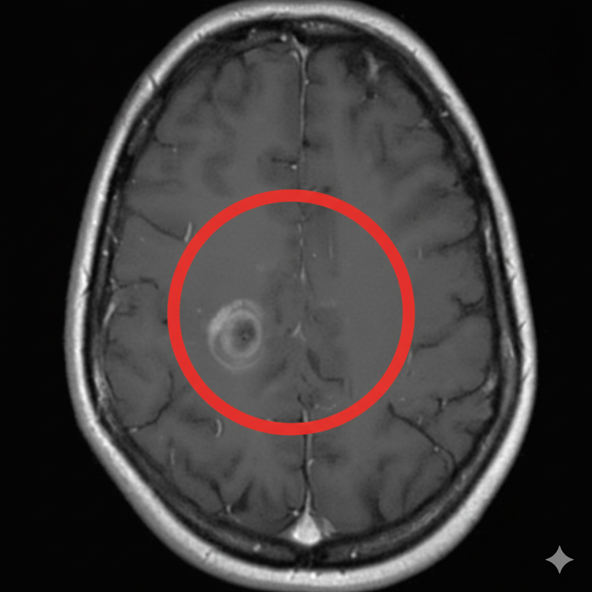 |

[æ•°æ®èµ„æº](https://www.eurorad.org/case/17946)

### 示例 2：CT 图åƒä¸­å¼‚常区域的检测

<details>
<summary>显示æ示</summary>

```
Detect and localize abnormal regions in this CT image. Highlight abnormal areas with bounding boxes.
```
</details>

| 输入 | 输出 |
|-------|--------|
|  |  |

[æ•°æ®èµ„æº](https://www.eurorad.org/case/19205)

### 示例 3：移除 MRI 中的ä¸å¥åº·åŒºåŸŸ (a)

<details>
<summary>显示æ示</summary>

```
Remove the unhealthy or abnormal areas in the images and generate a healthy version of the image.
```
</details>

| 输入 | 输出 |
|-------|--------|
| 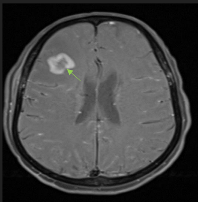 |  |

[æ•°æ®èµ„æº](https://www.eurorad.org/case/18826)

### 示例 4：移除 MRI 中的ä¸å¥åº·åŒºåŸŸ (b)

<details>
<summary>显示æ示</summary>

```
Remove the unhealthy or abnormal areas in the images and generate a healthy version of the image.
```
</details>

| 输入 | 输出 |
|-------|--------|
|  |  |

[æ•°æ®èµ„æº](https://www.eurorad.org/case/19195)

### 示例 5：生æˆå¤§è„‘çš„å¥åº·ç‰ˆæœ¬

<details>
<summary>显示æ示</summary>

```
Generate a healthy version of this brain.
```
</details>

| 输入 | 输出 |
|-------|--------|
| 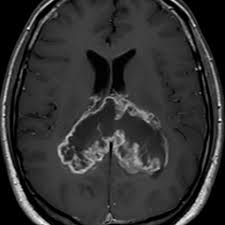 |  |

[æ•°æ®èµ„æº](https://www.eurorad.org/case/13910)

### 示例 6：注释 MRI 而ä¸æ”¹å˜åƒç´ 

<details>
<summary>显示æ示</summary>

```
Annotate this MRI without altering the original pixels. Add overlays/annotations only.
```
</details>

| 输入 | 输出 |
|-------|--------|
|  | 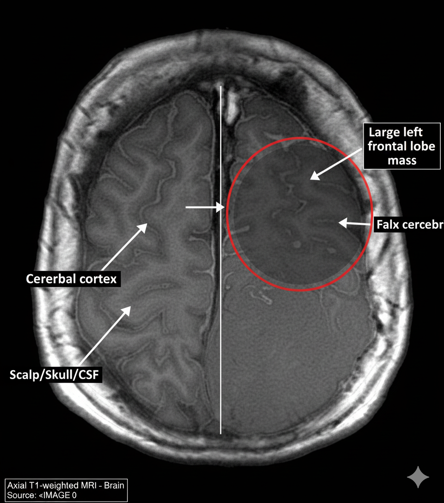 |

[æ•°æ®èµ„æº](https://www.eurorad.org/case/7941)

### 示例 7：注释手术图åƒè€Œä¸æ”¹å˜åƒç´ 

<details>
<summary>显示æ示</summary>

```
Annotate this surgical image without altering the original pixels. Add overlays/annotations only.
```
</details>

| 输入 | 输出 |
|-------|--------|
|  |  |

[æ•°æ®èµ„æº](https://www.eurorad.org/case/18515)

### 示例 8：识别 MRI 中的æˆåƒè§†å›¾å’Œè§£å‰–区域

<details>
<summary>显示æ示</summary>

```
Identify the imaging view (axial, sagittal, or coronal) and anatomical region shown in this scan.
Overlay a small text label in the corner with the view and body region.
```
</details>

| 输入 | 输出 |
|-------|--------|
|  | 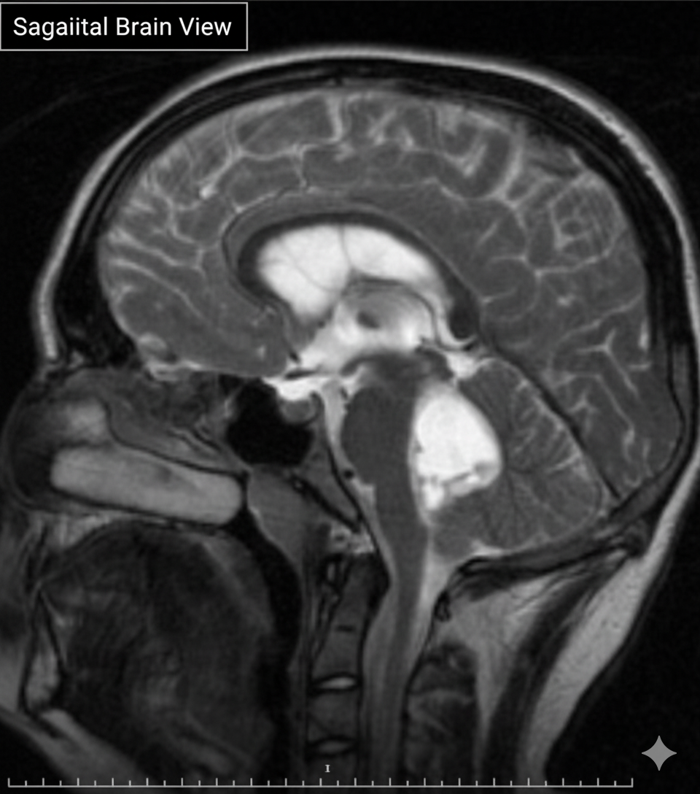 |

[æ•°æ®èµ„æº](https://www.eurorad.org/case/17344)

### 示例 9ï¼šä» MRI 扫æ中移除注释

<details>
<summary>显示æ示</summary>

```
Remove all annotations, arrows, labels, text, and markers from this scan image. Reconstruct the underlying anatomy naturally and seamlessly, keeping the original texture, contrast, and medical details intact. Do not alter or blur anatomical structures.
```
</details>

| 输入 | 输出 |
|-------|--------|
|  | 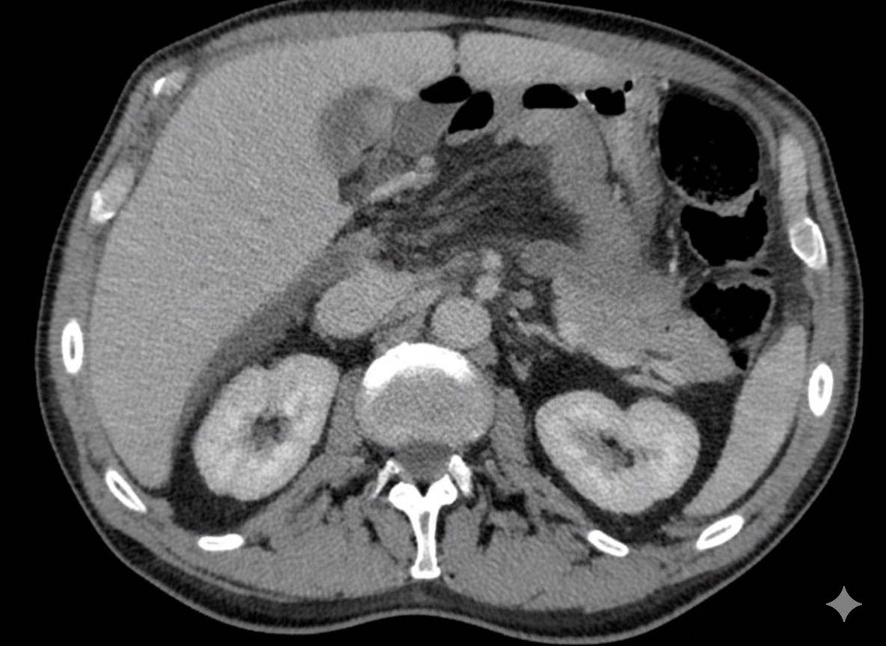 |

[æ•°æ®èµ„æº](https://www.eurorad.org/case/18515)

### 示例 10：ä»æ‰‹æœ¯æ‰«æ中移除注释

<details>
<summary>显示æ示</summary>

```
Remove all annotations, arrows, labels, text, and markers from this scan image. Reconstruct the underlying anatomy naturally and seamlessly, keeping the original texture, contrast, and medical details intact. Do not alter or blur anatomical structures.
```
</details>

| 输入 | 输出 |
|-------|--------|
|  | 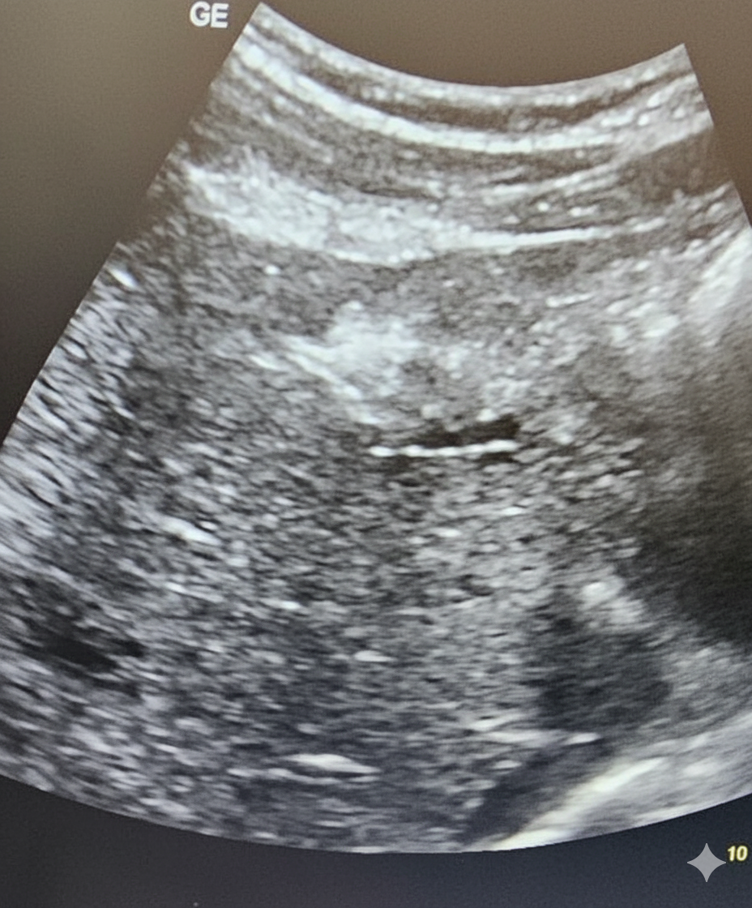 |

[æ•°æ®èµ„æº](https://www.eurorad.org/case/18816)

### 示例 11ï¼šä» MRI 图åƒä¸­ç§»é™¤é¢…骨

<details>
<summary>显示æ示</summary>

```
Please remove the skull from the image. It appears as the outermost bright white border.
```
</details>

| 输入 | 输出 |
|-------|--------|
|  |  |

[æ•°æ®èµ„æº](https://www.eurorad.org/case/19196)

### 示例 12ï¼šä» MRI 图åƒä¸­ç§»é™¤é¢…骨（替代方案）

<details>
<summary>显示æ示</summary>

```
1. Remove the skull from the image and retain only show the brain region in the final output. 
2. yes correct, but you change the brain, you should not change the brain
```
</details>

| 输入 | 输出1 |输出2 |
|-------|--------|--------|
| 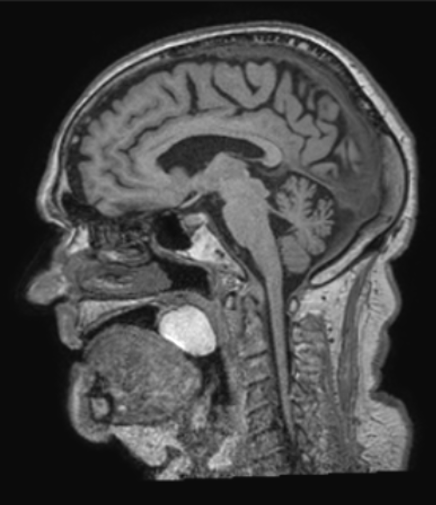 | 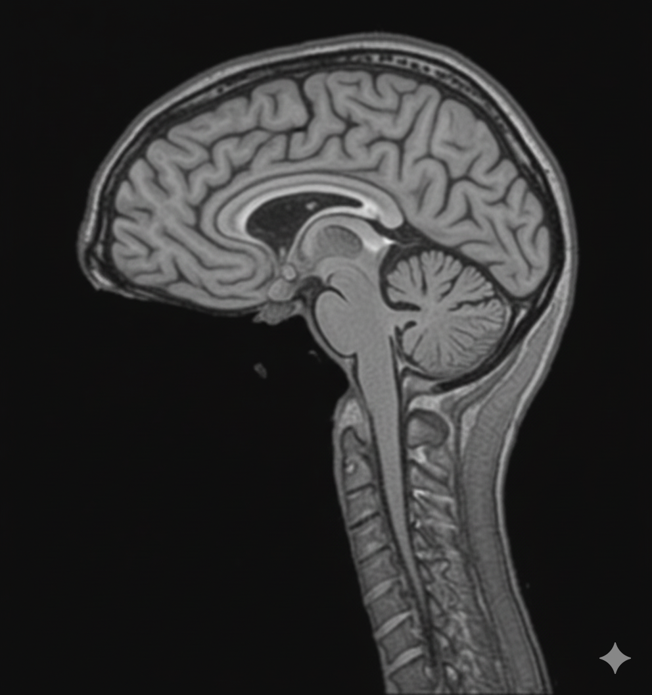 |  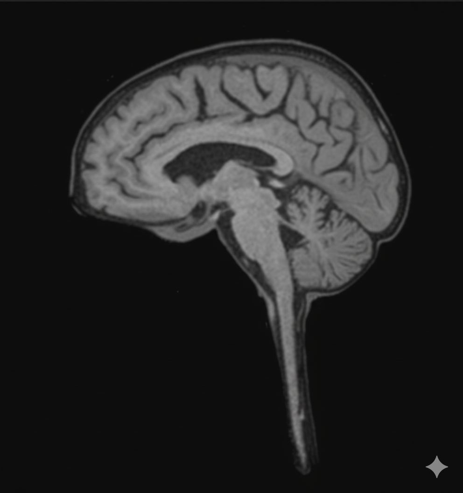 |

[æ•°æ®èµ„æº](https://www.eurorad.org/case/17504)

### 示例 13：ä»å¿ƒè„ MRI 生æˆè¶…声

<details>
<summary>显示æ示</summary>

```
Generate a realistic transthoracic echocardiographic (ultrasound) image of the human heart in a similar view and orientation as the provided cardiac MRI image. The image should depict the left ventricle, left atrium, and mitral valve region with clear grayscale ultrasound texture, realistic speckle noise, and anatomical detail. The mitral valve leaflets should be visible with slight curvature consistent with systole. Use appropriate ultrasound shading, acoustic shadowing, and tissue echogenicity. The overall appearance must resemble a real clinical echocardiogram, not a diagram or illustration.
```
</details>

| 输入 | 输出 |
|-------|--------|
| 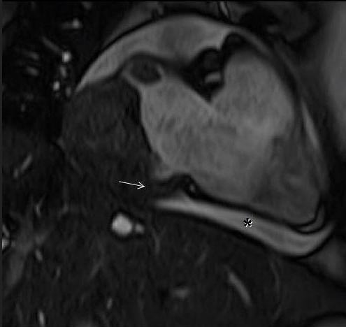 |  |

[æ•°æ®èµ„æº](https://www.eurorad.org/case/13950)

### 示例 14：ä»çŸ¢çŠ¶ MRI ç”Ÿæˆ 3D 脊柱模å‹

<details>
<summary>显示æ示</summary>

```
Generate a realistic 3D anatomical model of the human spine based on the provided sagittal MRI image. The 3D reconstruction must precisely match the curvature, alignment, and proportions of the vertebrae as seen in the MRI. Include detailed vertebral bodies, intervertebral discs, spinal canal, and surrounding soft tissue outlines. Maintain anatomical accuracy of thoracic and lumbar segments, preserving the same posture and sagittal orientation as the original MRI. Render the 3D model in a semi-transparent medical visualization style with realistic bone texture and soft lighting. The result should look like a 3D version of this MRI slice, without any change in direction or angle.
Emphasize: same sagittal view, same curvature, anatomically correct spine model reconstructed from MRI data.
```
</details>

| 输入 | 输出 |
|-------|--------|
|  |  |

[æ•°æ®èµ„æº](https://www.eurorad.org/case/14834)

### 示例 15ï¼šä» 3D 腹部é‡å»ºç”Ÿæˆè…¹éƒ¨ CT

<details>
<summary>显示æ示</summary>

```
Generate abdominal CT image from the 3D abdomen volume reconstruction.
```
</details>

| 输入 | 输出 |
|-------|--------|
| 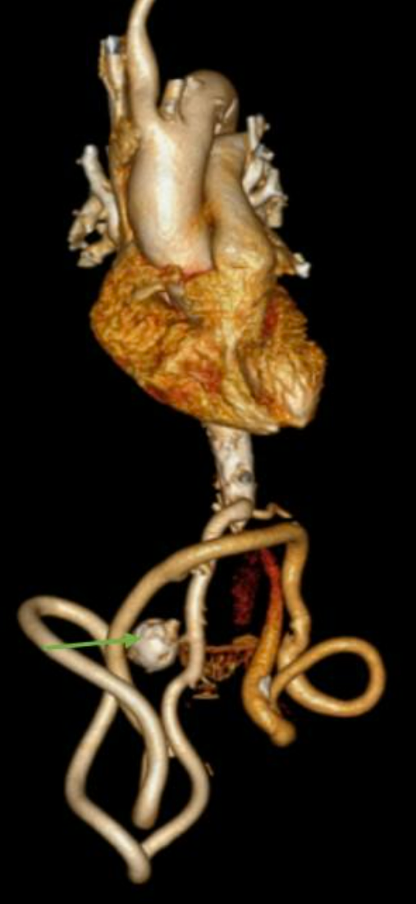 | 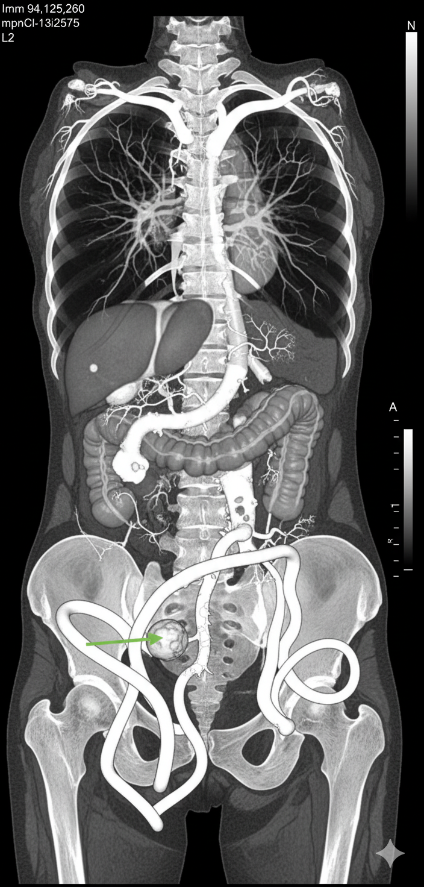 |

[æ•°æ®èµ„æº](https://www.eurorad.org/case/19173)

### 示例 16：生æˆå¤§è„‘çš„ 3D 网格

<details>
<summary>显示æ示</summary>

```
Generate a 3D mesh of this brain.
```
</details>

| 输入 | 输出 |
|-------|--------|
|  | 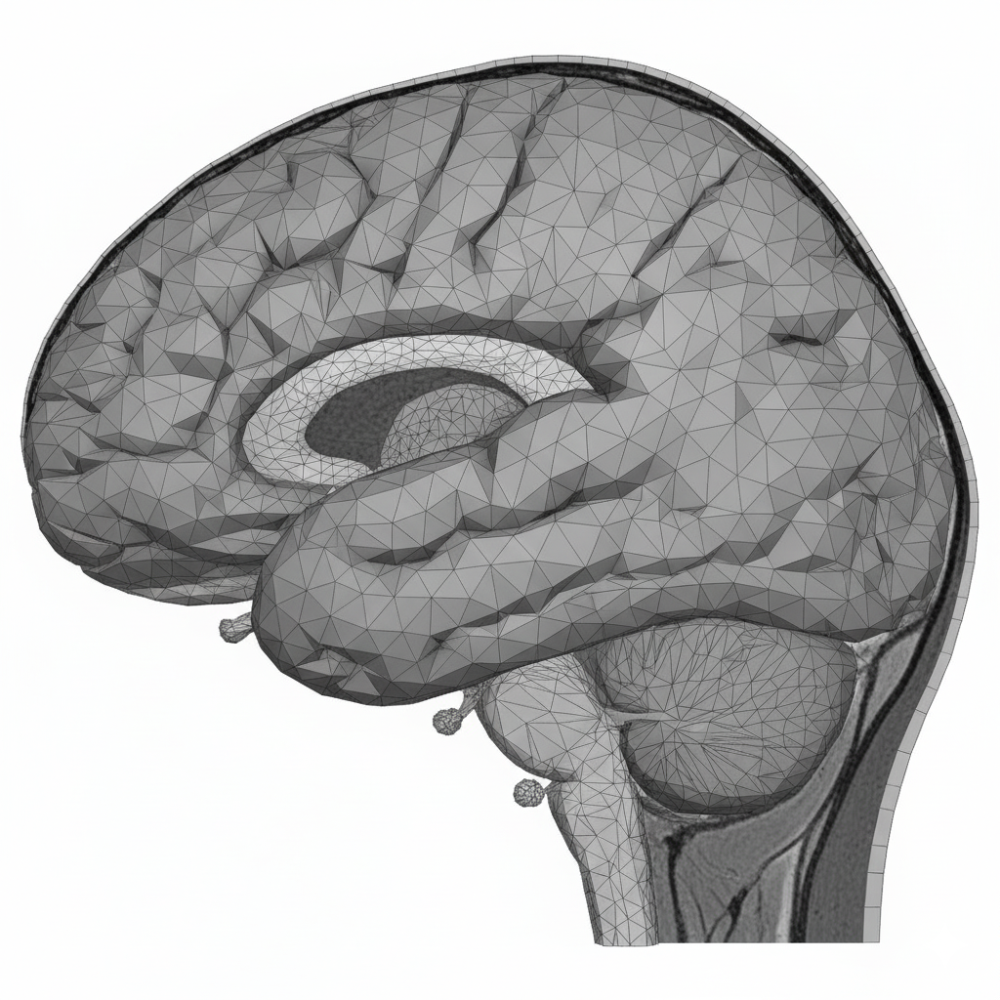 |

[æ•°æ®èµ„æº](https://www.eurorad.org/case/18099)

### 示例 17：生æˆç‰™é½¿çš„ 3D 网格

<details>
<summary>显示æ示</summary>

```
Generate a 3D mesh of the teeth.
```
</details>

| 输入 | 输出 |
|-------|--------|
| 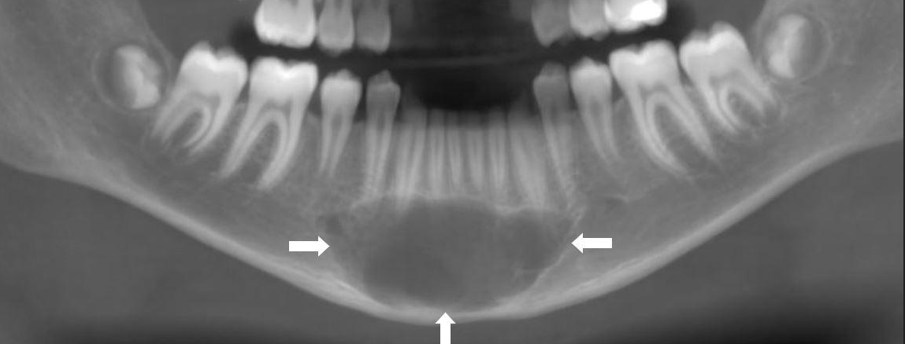 | 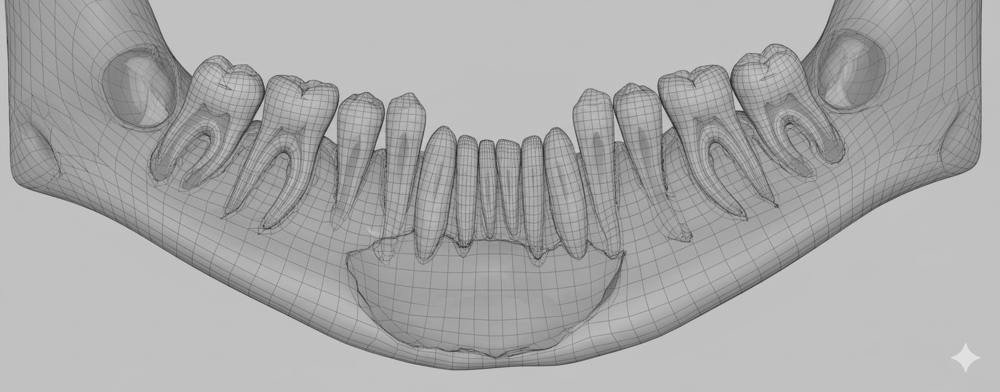 |

[æ•°æ®èµ„æº](https://www.eurorad.org/case/17181)

### 示例 18：模拟大脑中肿瘤进展

<details>
<summary>显示æ示</summary>

```
The red box indicates the tumor region for reference only — do not display the box in the output.
Simulate advanced-stage tumor progression in that region: enlarge the lesion by approximately 50% relative to the original size.
Keep all other brain anatomy, alignment, and texture identical to the original image, with no artifacts or hallucinated structures.
```
</details>

| 输入 | 输出 |
|-------|--------|
|  | 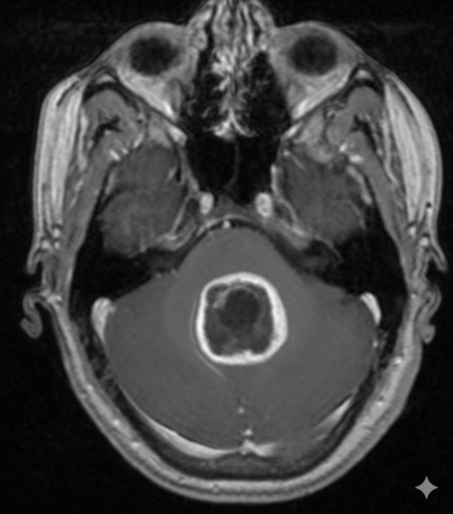 |

[æ•°æ®èµ„æº](https://www.eurorad.org/case/17344)

### 示例 19：ä»å¤§è„‘扫æ中移除病å˜

<details>
<summary>显示æ示</summary>

```
The red box indicates the lesion region to be removed — do not show the box in the output.
Generate a version of the scan with that lesion completely removed, restoring normal tissue appearance and continuity in that region.
Preserve all surrounding brain anatomy, alignment, intensity patterns, and MR noise exactly as in the original image.
The result must look anatomically realistic and artifact-free.
```
</details>

| 输入 | 输出 |
|-------|--------|
|  | 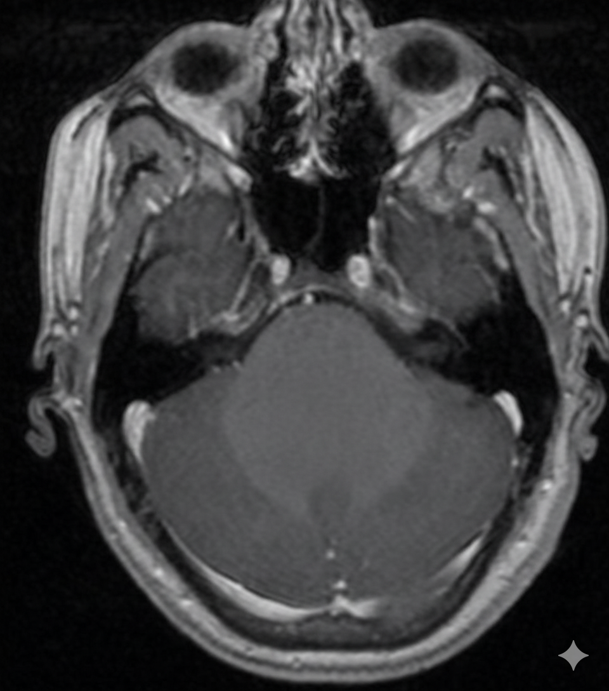 |

[æ•°æ®èµ„æº](https://www.eurorad.org/case/17344)

### 示例 20ï¼šä» MRI 扫æ中移除伪影 (1)
[æ•°æ®èµ„æº](https://www.auntminnieeurope.com/clinical-news/article/15648693/know-your-artifacts-to-optimize-mri-scans)
<details>
<summary>显示æ示</summary>
```
Use the provided scan as the anatomical reference.
Remove imaging artifacts or acquisition noise while keeping all brain structures, intensity gradients, and MR texture identical to the original.
Do not alter anatomy, contrast, or alignment.
```
</details>

| 输入 | 输出 |
|-------|--------|
|  |  |

### 示例 21ï¼šä» MRI 扫æ中移除伪影 (2)
[æ•°æ®èµ„æº](https://link.springer.com/article/10.1007/s00330-006-0470-4)

<details>
<summary>显示æ示</summary>

```
Remove the imaging artifacts and restore normal brain tissue appearance while preserving all anatomical structures, symmetry, and MR intensity patterns.
Keep the ventricles, cortex, and white matter boundaries identical to the original scan.
Produce a clean, artifact-free, anatomically faithful version that looks realistic and consistent with standard T1 MRI.
```
</details>

| 输入 | 输出 |
|-------|--------|
|  | 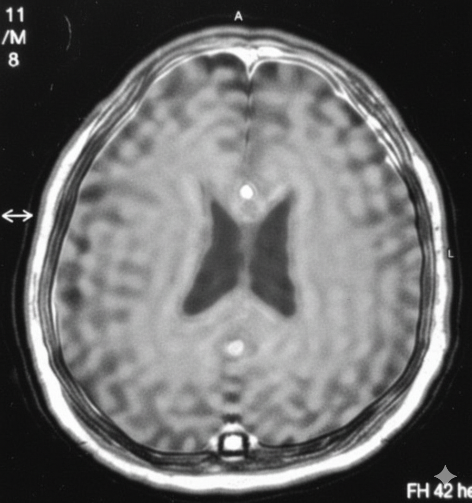 |


### 示例 22：分割图åƒä¸­æ‰€æœ‰å¯è§å™¨å®˜

<details>
<summary>显示æ示</summary>

```
Segment all visible organs in the image..
```
</details>

| 输入 | 输出 |
|-------|--------|
|  |  |

[æ•°æ®èµ„æº](https://www.eurorad.org/case/15782)

### 示例 23：分割图åƒä¸­æ‰€æœ‰å¯è§å™¨å®˜ï¼ˆå åŠ ï¼‰

<details>
<summary>显示æ示</summary>

```
Segment all visible organs in the image..
```
</details>

| 输入 | 输出 |
|-------|--------|
|  | 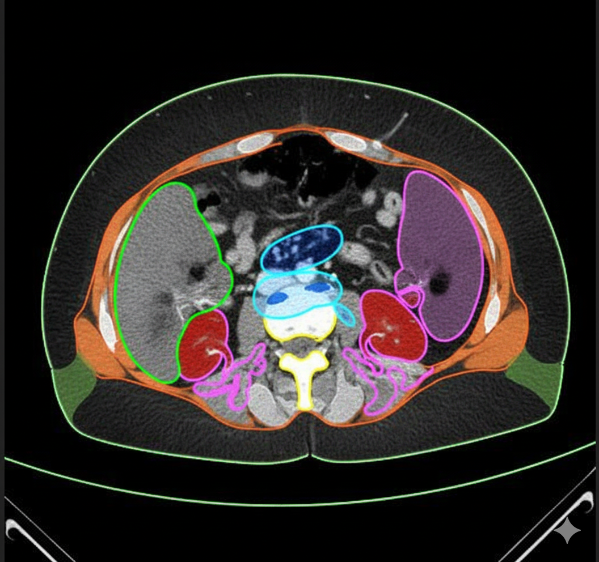 |

[æ•°æ®èµ„æº](https://www.eurorad.org/case/15782)

### 示例 24：生æˆå¿ƒè„室的åƒç´ çº§åˆ†å‰²

<details>
<summary>显示æ示</summary>

```
Generate pixel-level segmentation of the cardiac chambers.
```
</details>

| 输入 | 输出 |
|-------|--------|
|  |  |

[æ•°æ®èµ„æº](https://www.eurorad.org/case/17698)

### 示例 25：生æˆå¤§è„‘胶质瘤的åƒç´ çº§åˆ†å‰²

<details>
<summary>显示æ示</summary>

```
Generate a pixel-level segmentation of the brain glioma.
```
</details>

| 输入 | 输出 |
|-------|--------|
|  |  |

[æ•°æ®èµ„æº](https://www.eurorad.org/case/13910)

### 示例 26：生æˆå¤§è„‘分割

<details>
<summary>显示æ示</summary>

```
Generate the brain segmentation
```
</details>

| 输入 | 输出 |
|-------|--------|
| 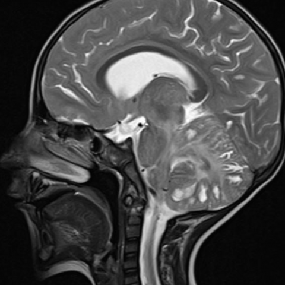 |  |

[æ•°æ®èµ„æº](https://www.eurorad.org/case/17773)


## 📊 æ•°æ®é›†
æ¥æºï¼šEURORAD (https://eurorad.org)。  
许å¯è¯ï¼šè¯·å‚考æ¥æº

## ğŸ› ï¸ å·¥å…·

所有示例å‡ä½¿ç”¨ [Google AI Studio](https://aistudio.google.com/) ä¸ Gemini-2.5-Flash-Image 模å‹ç”Ÿæˆã€‚温度和 top_p 使用默认å‚数。

请注æ„，由äºç”Ÿæˆ AI 模å‹çš„固有å˜å¼‚性，在多次è¿è¡Œä¸­è¾“出å¯èƒ½ç•¥æœ‰ä¸åŒã€‚

## 👀 观察

### 优势
在测试期间，我们å‘ç° Nano Banana 展示了出色的多任务处ç†èƒ½åŠ›ï¼Œèƒ½å¤Ÿå¤„ç†å„ç§åŒ»å­¦æˆåƒä»»åŠ¡ï¼ŒåŒ…括一些éå¸¸è§„åº”ç”¨ï¼Œå¦‚ä» 2D 医学扫æ图åƒç”Ÿæˆ 3D 模å‹ã€‚

### 医学æˆåƒåº”用中的局é™æ€§
尽管 Nano Banana 作为通用模å‹æ‹¥æœ‰å¹¿æ³›èƒ½åŠ›ï¼Œä½†åœ¨åŒ»å­¦æˆåƒåº”用中ä»æœ‰ä¸€äº›å±€é™æ€§ï¼š

1. **幻觉问题**：模å‹å€¾å‘äºäº§ç”Ÿå¹»è§‰ï¼Œç”Ÿæˆè™šå‡æˆ–解剖学ä¸ä¸€è‡´çš„内容，å³ä½¿åœ¨ä¸€èˆ¬é¢†åŸŸä¿æŒè½»å¾®ä¸€è‡´æ€§ï¼Œä¹Ÿä¼šå离åŸå§‹åŒ»å­¦å›¾åƒã€‚

2. **处ç†å¤æ‚æ示的困难**：Nano Banana 在处ç†è¿‡äºå¤æ‚或冗长的æ示时é‡åˆ°å›°éš¾ã€‚简æ´æ˜äº†çš„æ示通常会导致更好的对é½ç»“æœã€‚

3. **上下文学习能力**：模å‹å…·å¤‡ä¸Šä¸‹æ–‡å­¦ä¹ èƒ½åŠ›ã€‚对äºå‡ºç°é”™è¯¯çš„任务，当指出错误或æä¾›å‚考示例时，模å‹å¯ä»¥çº æ­£å¹¶æ”¹è¿›å…¶æ€§èƒ½ã€‚

4. **生æˆéšæœºæ€§**：模å‹çš„生æˆè¿‡ç¨‹æœ¬è´¨ä¸Šæ˜¯éšæœºçš„，å³ä½¿ä½¿ç”¨æ¸©åº¦=0 或æ§åˆ¶ top-p å‚数，也难以å®ç°å®Œå…¨ä¸€è‡´çš„输出。

5. **在简å•ä»»åŠ¡ä¸Šçš„出色表ç°**：模å‹åœ¨å…·æœ‰æ¸…æ™°æ•°æ®çš„简å•ä»»åŠ¡ä¸Šè¡¨ç°å‡ºè‰²ï¼Œä¾‹å¦‚ä»åŒ»å­¦æ‰«æ图åƒä¸­ç§»é™¤æ³¨é‡Šæˆ–标签。

6. **多轮æ¨ç†çš„å¢å¼ºæ•ˆæœ**：多轮迭代æ¨ç†å¯ä»¥æ˜¾è‘—æ高生æˆè¾“出的质é‡å’Œå‡†ç¡®æ€§ã€‚


## 🤠贡献

有关详细贡献指å—，请å‚è§ [contribution.md](contribution.md)。我们欢è¿æ‚¨è´¡çŒ®ä»¥æ‰©å±•æˆ‘们的示例集åˆï¼Œå¹¶æ¨è¿›å¯¹ AI 在医学æˆåƒä¸­åº”用的ç†è§£ï¼

## 📖 引用
如æœæ‚¨åœ¨ç ”究中使用此资æºï¼Œè¯·å¼•ç”¨ï¼š

```bibtex
@misc{awesome_nano_banana_medical,
  title={Awesome Nano Banana for Medical Imaging},
  author={Your Name},
  year={2025},
  publisher={GitHub},
  howpublished={\url{https://github.com/yourusername/awesome-nanobannan-for-medical-imaging}}
}
```

## 🙠感谢

感谢以下仓库的作者和维护者æ供的çµæ„Ÿï¼š

- [JimmyLv/awesome-nano-banana](https://github.com/JimmyLv/awesome-nano-banana)
- [PicoTrex/Awesome-Nano-Banana-images](https://github.com/PicoTrex/Awesome-Nano-Banana-images)